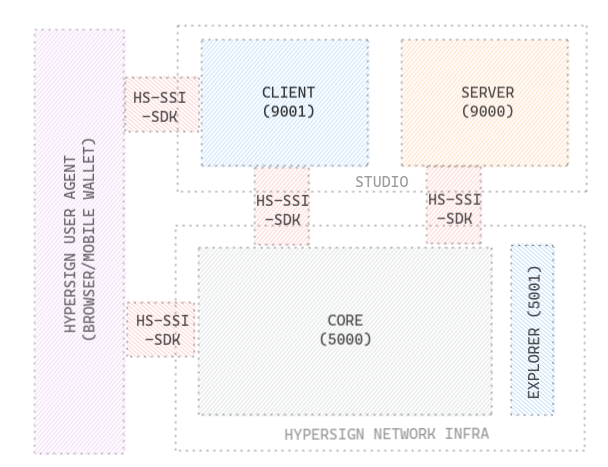

# hypersign-docker


## Components

* [Core](https://github.com/hypersign-protocol/core)
* [Explorer](https://github.com/hypersign-protocol/explorer)
* [Studio](https://github.com/hypersign-protocol/studio)
    * Client
    * Server

## Architecture




## Run containers

```bash
./restart.sh
```


## Stop containers

```bash
./stop.sh
```

