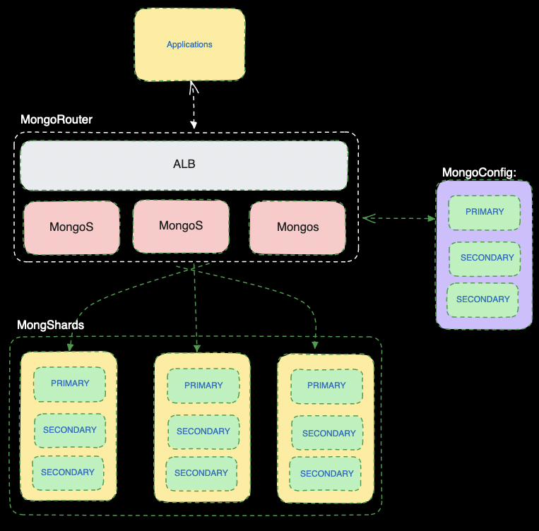

## Run shards 

```bash
sh run-shard.sh
```

## Enable sharding on db "demo" and collection "users"


Connect to `mongos`:
```bash
mongosh --host localhost --port 27017
```
Then,

```bash
use demo; # Step1: Create a database
sh.enableSharding("demo"); # Step2: Enable sharding for db "demo"
db.users.createIndex({name: "hashed"}); # Step3: Create index (shard key) for collection 'users'
sh.shardCollection("demo.users", {name: "hashed"}); # Step4: Finally, add  shard key in collection
```
Other important commands:

```bash
db.users.getShardDistribution(); # check sharding status for users collection
db.printShardingStatus();  # print sharding status
sh.getBalancerState(); # print balancer state
sh.status()
```

## Deployment Architecture




## Dumping 


```bash
sh mongodump.sh
```

## Restoring

First run your server 
```bash
ulimit -n 64000  && rm -rf ~/.mongo && mkdir ~/.mongo && mongod --dbpath ~/.mongo --port 2717
```


```bash
cd dir # into dir where all files are exported'
sh mongorestore.sh
```